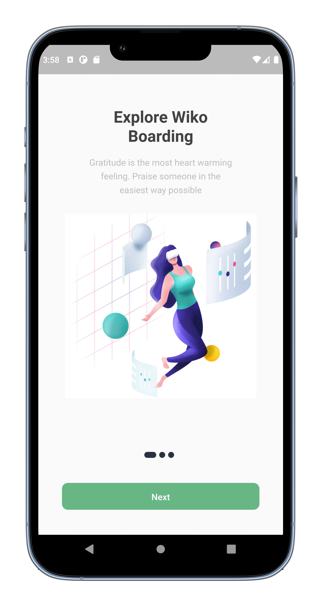
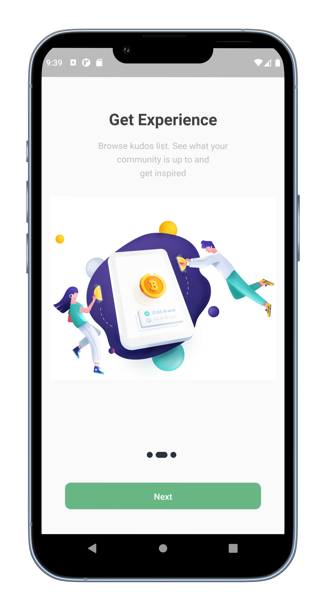
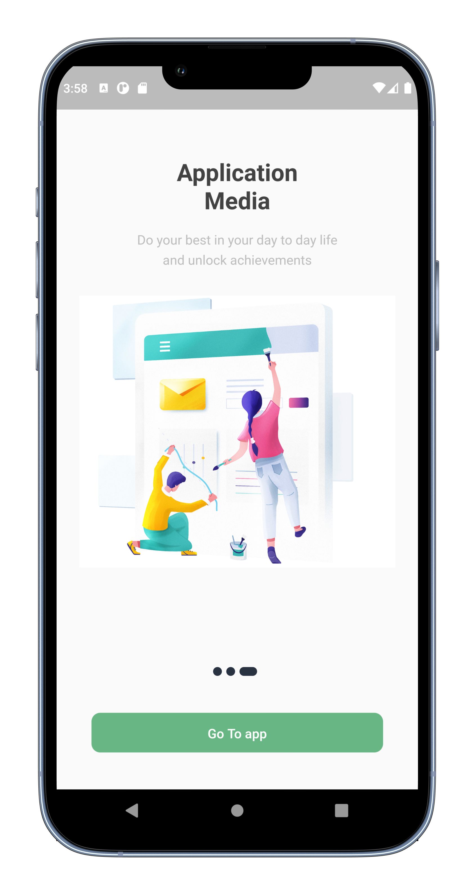

# Flutter_Onboarding Screen

Create a Flutter App On boarding screen in Visual Studio from scratch without using any library.

Create your custom and beautiful onboarding screens easily with Flutter

## [Watch it on YouTube](https://youtu.be/ZxIOeuowZgc)

## Screens it contains:

=> Onboarding Screen

Now it contains all the screen, thanks for your love and support 🙏 

## Photos

